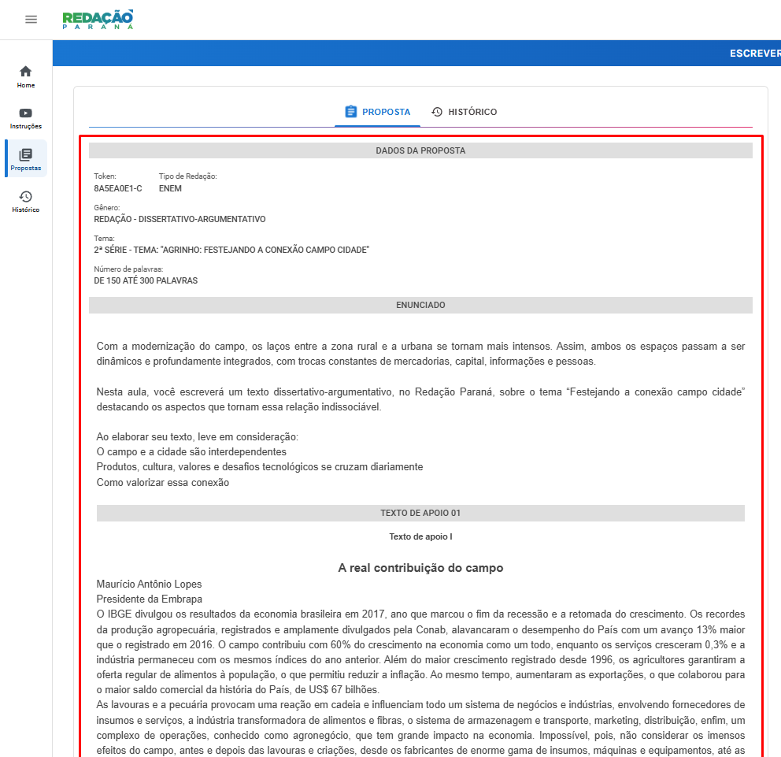

# zmc_hacks
Aqui são coisas simples que fiz pra facilitar minha vida na escola (estudo no Paraná, então se você estuda no mesmo estado que eu, isso pode te ajudar)

## [Redação Paraná](https://redacao.pr.gov.br) `[redacaoparana]`:

### Aqui estão todos os meus hacks relacionados a plataforma Redação Paraná

`replaceText.js` - Este script escreve seu texto, apenas gere um texto em uma IA (como o [Gemini](https://gemini.google.com/app?hl=pt-BR)) e cole o título, texto e execute). F12 > Console > Paste & Run

Exemplos de Prompts:
Gemini: "Gere um texto entre 220 e 280 palavras com uma linguagem formal, como se uma pessoa que tem entre 16 a 18 anos tivesse escrito, escreva um título não muito complexo (entre 3 a 7 palavras), não use girias mas também não use linguagem coloquial. As informações estão aqui:" (Cole todas as informações destacadas abaixo, incluindo o subtítulo)

[a Fork of [this repository](https://github.com/Dioguinho-max/Redacao-parana-hack)]

## [Khan Academy](https://www.pt.khanacademy.org) `[khanacademy]`:

### Aqui estão todos os meus hacks relacionados a plataforma Khan Academy

`khanware.js` - Este script executa um bypass no Khan Academy inteiro, tanto para questões (apenas responda as questões com "By Nix, Featured by Vz"), quanto de videos (Em testes, apenas abra a questão com o video). F12 > Console > Paste & Run

[a Fork of [this repository](https://github.com/Niximkk/Khanware)]
